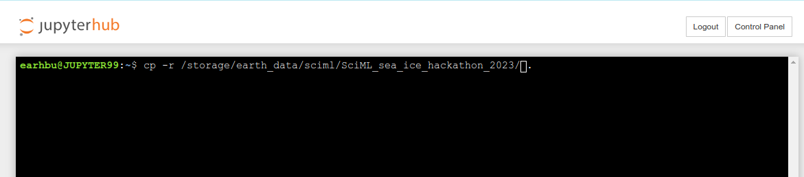

# Jupyter Hub 99

This the Leeds university run jupyter hub for environmental sciences teaching. Temporary access has been granted to those on the course for instant access to a jupyter hub server with the data and python environment pre installed.

1. Navigate to: [https://see-jupyter99.leeds.ac.uk/sciml](https://see-jupyter99.leeds.ac.uk/sciml)
2. Sign in with your leeds credentials
3. Open Terminal (screen shots Below) 
4. enter `cp -r /storage/earth_data/sciml/SciML_sea_ice_hackathon_2023/ .`
5. Close window and open the tutorial folder and open the `Introduction_JupyterHub99.ipynb`

